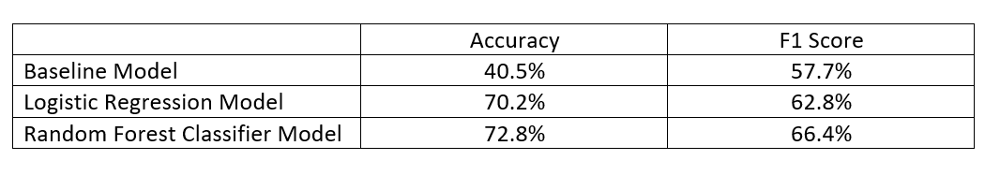

# Starbucks Capstone Challenge 
## Table of Contents
1. Project Overview
2. Getting Started
3. Methodology
4. Results
5. Acknowledgements

## Project Overview 
The Starbucks Udacity Data Scientist Nanodegree Capstone data set is a simulation of customer behavior on the Starbucks rewards mobile application. Periodically, Starbucks sends offers to users that may be an advertisement, discount, or buy one get one free (BOGO). The challenge is to combine data on offer characteristics, customer demographics, and customer engagement to determine which demographic groups respond best to different offer types.

Problem statement: How can Starbucks optimize the success of app offers?

### File descriptions
The data is contained in three files. Here is the schema and explanation of each variable in the files:

##### portfolio.json - containing offer ids and meta data about each offer (duration, type, etc.)

* id (string) - offer id
* offer_type (string) - type of offer ie BOGO, discount, informational
* difficulty (int) - minimum required spend to complete an offer
* reward (int) - reward given for completing an offer
* duration (int) - time for offer to be open, in days
* channels (list of strings)

##### profile.json - demographic data for each customer

* age (int) - age of the customer
* became_member_on (int) - date when customer created an app account
* gender (str) - gender of the customer (note some entries contain 'O' for other rather than M or F)
* id (str) - customer id
* income (float) - customer's income

##### transcript.json - records for transactions, offers received, offers viewed, and offers completed

* event (str) - record description (ie transaction, offer received, offer viewed, etc.)
* person (str) - customer id
* time (int) - time in hours since start of test. The data begins at time t=0
* value - (dict of strings) - either an offer id or transaction amount depending on the record

## Getting Started
#### Dependencies
* pandas
* numpy
* matplotlib
* sklearn
* seaborn

## Methodology
I started by conducting initial data exploration to determine how each data set would have to be cleaned. This including dropping missing data, getting dummies, converting data types, and renaming for clarity. Each data set required some cleaning and preparation in order to glean insight from the test period. Then I conducted deeper exploratory analysis and created visualizations to find patterns and inconsistencies in the data. This informed the way I merged the data and the new variables I engineered. 

After cleaning and exploration, I implemented my predictive models. I built 3 models for comparison and refinement: a baseline model, logistic regression model, and a random forest classification model. I used GridSearchCV for cross validation and fine tuning of the hyperparameters to improve performance of the models. 

## Results
I summarized the results of each model in the table below. After running the 3 different models and testing for the best hyperparameters, the random forest classifier achieved the highest performance metrics! Even though I prioritized the F1 score metric to evaluate the performance of the models, the accuracy score also supports the conclusion that the random forest classifier is a better predictive measure of offer success.

A deeper discussion of this analysis  findings can be found at: https://medium.com/@m.knox0826/how-can-starbucks-make-me-offers-i-cant-refuse-5c9a16168d95

#### Acknowledgements
* [Udacity](https://www.udacity.com/) for providing such a complete Data Science Nanodegree Program
* Starbucks for providing the datasets 